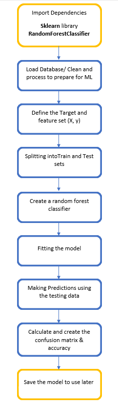

# Covid19_PHU

### Communication protocol:
A group chat has been set up in Slack.  This will be the primary platform for ongoing correspondence by each team member while working on our individual roles for each segment.  Every Monday and Wednesday evenings will be an opportunity to meet via zoom and discussing the current week's agenda.  Every Sunday the team will connect via Google Meet as well to finalize the submission of the current week.  Additional meetings will be set up throughout the week when needed. 
Phone numbers have been exchanged and a group chat set up on WhatsApp for ad hoc communications as well.  
*Collaborators:* [Lida](https://github.com/lidajav), [Tarana](https://github.com/taranahassan), [Michelle](https://github.com/MichelleGoldfinger), [Blessing](https://github.com/Physsyb), [Faridah](https://github.com/faridah-m).

### Team Member roles:
***Tarana:***  Setting up repository, branches and updating README.md. 
***Faridah:***  Explanation of the ETL process on data. 
***Michelle:***  Creating an ERD for the mockup database to be used. 
***Lida:*** Creating the mockup machine learning model to be used.  
***Blessing:***  Explanation of which technologies group will be using and why.

# Machine Learning

### The Machine learning model: 
RandomForest classifier (RFC) from ML sklearn library

### Training and testing set:  
Dates (broken into month and year), PHU (public health unit), location, number of Covid cases resolved and death cases per PHU.

### Target: 
Active cases.
The model is going to predict PHUs with high active cases to help the government for allocating budgets. 

### The reasons for choosing the ML model: 
The model has high accuracy and is robust to outliers. There are also low correlations in features that requires multiple learning algorithms. 

