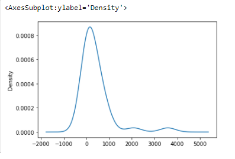
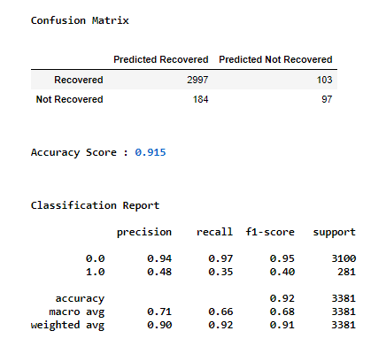

  

# Covid-19 and Public Health Units in Ontario

## Overview
This project is to showcase the strategical thinking and group efforts to predict and analyze the Covid-19 data. It is to recognize the trends of the highs and lows of Covid 19 cases at each of the 34 Public Health Unit in Ontario, Canada. 
 
## Communication protocol
A group chat has been set up in Slack.  This will be the primary platform for ongoing correspondence by each team member while working on our individual roles for each segment.  Every Monday and Wednesday evenings will be an opportunity to meet via zoom and discussing the current week's agenda.  Every Sunday the team will connect via Google Meet as well to finalize the submission of the current week.  Additional meetings will be set up throughout the week when needed. 
Phone numbers have been exchanged and a group chat set up on WhatsApp for ad hoc communications as well.  
*Collaborators:* [Lida](https://github.com/lidajav), [Tarana](https://github.com/taranahassan), [Michelle](https://github.com/MichelleGoldfinger), [Blessing](https://github.com/Physsyb), [Faridah](https://github.com/faridah-m).

### Team Member roles:
***Tarana:***  Managining github and creating interactive dashboard. 
***Faridah:***  Creating presentation on google slides 
***Michelle:***  Creating an ERD and database. 
***Lida:*** Creating the machine learning model.  
***Blessing:***  Creating dashboard using a BI tool.

# Research goal
***How do we determine the eligibility to excute a vaccination roll-out program?***

The goal of this analysis is to create a standard operating procedure (SOP) to determine a vaccine roll-out program.   The process stated here is to assist the Ministry of Health to identify, prioritize and execute vaccinations based on age group and or gender for future epidemics and pandemics.   
Data of current confirmed Covid-19 cases have been collected and used to create a machine learning model that can provide predictions and help understand the probability of higher cases within a specific attribute of demographics.   
The same data has been used for exploratory analysis to isolate results of each age group and gender for each Public Health Units.   
Below are the steps taken to provide results for this analysis.

 
**Data source:** 
 

[Ontario Data Catalogue](https://data.ontario.ca/dataset/confirmed-positive-cases-of-covid-19-in-ontario/resource/455fd63b-603d-4608-8216-7d8647f43350)
 

## Extract, Transform & Load

The original data downloaded had 527,180 records which is a much larger file to work with and push in github.  Therefore the dataset has been scaled down using a random sample method and creating a [sample_covid_dataset.csv](https://github.com/UofT-Government-Project/Covid19_PHU/blob/main/Datasource/sample_covid_dataset.csv), resulting in 13,524 records. 
This sampled dataset has been used for the database, machine learning model and the exploratory analysis.
 
Each team member has used the ETL process and saved work under their respective branches to show different perspectives if any.  

The general process that we will be following is as shown below:

### Extract:

For the extract process, the sample dataset was pulled and read using Pandas in Python in a Jupyter notebook file.  Allowing the team to use multiple libraries to transform the  data for required purposes.

### Transform:

The transformation process was required to clean data.  The primary aim of the transformation process is to transform the data into a consistent structure. 
  - Drop any columns deemed unnecessary to the analysis  
  - Drop any null values 
  - Renaming column names for efficiency 
  - Separating the case date column into week, month and year  
  - Filter for specific requirements to be used for each part of project.  

### Load:

Finally, data will be loaded into a PostgreSQL database for easy distribution. SQL databases are often the targets of ETL processes, and because SQL is so ubiquitous, even databases that don't use SQL often have SQL-like interfaces.  The dataset will also be used for the project dashboard.  
 

 
 

## Database 
After the cleaning and preprocessing of the dataset, the [cleaned_dataset](https://github.com/UofT-Government-Project/Covid19_PHU/blob/Week_2/Datasource/PHU_dataset_cleaned_michelle.csv) was split into four different tables.  Below is the ERD as a blueprint for the database, establishing the relationships created for each table.

### ERD:

 

### PostgreSQL Database:

The cleaned data was imported into a SQL database, Postgres using pgAdmin.  Using queries, a table named "phu" was created to host the entire dataset.  Further queries and fitering the main table, additional tables were created as well and then saved as csv files; [PHU_locations.csv](https://github.com/UofT-Government-Project/Covid19_PHU/blob/michelle/Covid19_Datasources/PHU_locations.csv), [phu_age_group_final.csv](https://github.com/UofT-Government-Project/Covid19_PHU/blob/michelle/Covid19_Datasources/phu_age_group_final.csv) and [phu_gender_final.csv](https://github.com/UofT-Government-Project/Covid19_PHU/blob/michelle/Covid19_Datasources/phu_gender_final.csv). 
*[schema1.sql](https://github.com/UofT-Government-Project/Covid19_PHU/blob/main/schema1.sql) file shows the queries.*

Using the newly saved csv files, four more tables were created and their corresponding data imported with queries. 
*[schema2.sql](https://github.com/UofT-Government-Project/Covid19_PHU/blob/Week_2/schema2.sql) file shows the additional queries.*
 

#### Tables from schema2.sql:
1.  PHU_locations - details containing the name and ID associated for a specific PHU (Public Health Unit) along with the coordinates and physical address for all of 34 units. 
2.  PHU - details include the age groups, gender, outcome for each case and the week, month and year for each case associated with each PHU.  An index ID was included to create a primary key to call on during queries.
3.  PHU_Gender_final - includes the gender and the count associated with each PHU ID.
4.  PHU_Age_Group_Final - contains the age group per case associated with each PHU ID.

### Joins:

Two more tables were created by joining tables using the inner join method:
  1.  phu_by_age_and_outcome  

  2.  phu_by_gender_and_outcome  

### Connection String:

To create a connection from the database into PostgreSql, the SQLAlchemy's create engine library was used to load the refined csv file.

### Database Storage:

A database instance was created on AWS' RDS (relational database) and four buckets, one for each table, were created using S3 - a public cloud storage on AWS.

 

## Machine Learning

For a machine learning model, particular steps need to be followed to ensure a successful model.  
  

### The Machine learning model: 

With the sample dataset, the machine learning model created is to predict a patient's probability of recovery from the Covid-19 virus based on the age group and gender.   
Ideally a dataset with patients' health history, ie; existing health conditions, would allow the model to predict to it's fullest extent.  After alot of research for the ideal dataset, it was difficult to find one that includes other factors of a patient's health, to provide continuous features which would provide a better prediction.  This information may not be available to the general public assuming it would be a privacy issue.   However based on the current dataset being the most relatable to the analysis and model, the current data is limited to age group and gender.  Therefore the RandomForest classifier (RFC) from ML sklearn library has been selected for the machine learning model.  

### Cleaning and Preprocessing:

Similar to the ETL process, the dataset was required to be cleaned and preprocessed to avoid errors in the prediction.  The following steps were:
  - dropped unnecessary columns that have no impact on the predictation
  - renamed the column names
  - converted 'Case Date' column to ordinal Day by using toordinal function
  - checked the categorial features and generated variable list
  - checked the unique value counts for PHU_ID to see if binning is required
  - plotted the density of value count of PHU_ID to determine what values to replace.

 
 
  - binned all PHU_IDs with less than 400 to keep the number of features at 10
  - converted the categorial features to continues by using OneHotEncoder from sklearn library
  - merged the dataframes and dropped the categorial column

### Set the Target and features:

In order to focus the model's prediction to an outcome of "Recovered" or "Fatal, any rows with patients categorized as "Not Recovered" were removed.  These records would mean the case is still active and therefore not valid for a prediction.  
For the model, "Resolved" cases in the outcome column has been set as the target variable *(y)* and the remainder features set as *(X)* minus the outcome columns cases.

### Training and testing set:  

Following the named target and features, the data was then split to training and testing sets by using the train_test_split function from the sklearn library.   
Furthermore both training and testing data sets were then scaled to normalize the data.

### RandomForest Classifier ML model:

***The reasons why this model was selected***
  - because it reduces the chances of overfitting by using decision trees which improves high accuracy
  - the model is robust to outliers
  - it works well with both categorical and continous values
  - the correlation between features are minimal and therefore reduces the number of multiple learning algorithms
  - it automates missing values in the data

### Model Results:

After running the model, the accuracy score is 0.908.  The high accuracy score is due to the higher rate of recovered cases.   
Based on the Confusion Matrix below there are 3,152 Covid-19 cases used in the model.  The results identified:
  - out of 194 total fatal cases - 29% of the cases were predicted true and 71% were predicted falsely
  - out of 2,958 total resolved cases - 51% of the cases were predicted false and 49% were predicted correct.

 

### Limitations:

Though the RFC model has many positive attributes, there are some limitations in the performance.  
Training large number of deep trees can be expensive in terms of computing and memory usage required.  If the data was much more diverse, the model may not be able to interpret any comparision between individual decision trees.  The RFC model also cannot perform extensively with imbalanced data.
 
 
## Alternative Machine Learning Model

An alternative model was created using another dataset, [cases_by_status_and phu.csv](https://github.com/UofT-Government-Project/Covid19_PHU/blob/main/Datasource/cases_by_status_and_phu.csv).  This dataset was an exploratory model to predict exponential quantities and measure the accuracy of the model.  A Linear Regression was chosen due to the nature of the data.  
 
This dataset has 5 features; Date, PHU ID, Active cases, Resolved cases and Fatalities.  Data was cleaned using same steps as previous model.  Since the data is an accummulating data, it was normalized by calculating the square root, taking the results and squaring the numbers.  The data can also be normalized by using logarithm and reversing it by power operator. 
We used the "Deaths" as the target *(y)* and the date as the feature *(X)*.  The active and resolved cases were removed as they would impact the results negatively and cause overfitting.  Again the data was split into training and testing sets.  
 
Since the data is based on each of the 34 Public Health Units, the model would need to run individually for each location.  Therefore for this purpose, the model was focused on the Toronto Public Health Unit. 
 
After running the model the R_squared score was strong at 0.96.  
 
  
 
This model can predict the number of deaths in the near future if no external factor impacts the data.   It can be used to forecast the implications when the Ministry of Health need to weigh in the ideas of lockdown and or restrictions.  It can also assist the original goal of this analysis - a plan to execute a vaccination roll-out program. 
 
 

## Exploratory Analysis

In exploring the data with further analysis on Python, the results can identify and isolate specific information.  Such as:
  - Identifying the number of cases per age group.  Based on the pie chart below, the highest number of cases are within the 20 years of age at 14.7% and the lowest at 5.9% within the age of 70. 
 

 
  - Number of cases per gender.  This chart reveals females have been more of the victim for contracting Covid-19, at 54.1% vs. males at 45.1%.  
  

 
  - Cases by age and gender.  Below chart segregates the cases by gender and age.  Highest cases are females within the age of 40 and lowest are male in the ages of 90 +.  
  

 
  - Percentage of fatalities per gender reveals a higher rate for females at 6.41%, this would be obvious due to higher number of cases in females.  
 

 
 
 
 # Data Visualization using Tableau
 
 1.  Overview of Covid Cases

The image below shows the total number of cases, number of cases based on age group, gender and status.

### Cases by Age Group and Public Health Unit 
This image shows the number of cases by Public Health Unit ID vs Age group. 

### Cases by Public Health Unit
The image was created using tableau map. It shows the number of cases by public health unit. The larger the size, the larger the number of cases. The second image also shows gender by age PHU.

### Overview of Cases by Status
The image below represents covid status, that is, number of fatal, resolved and not resolved cases by age group, gender and PHU.

### covid Cases by Year/Month
In this image, we can see cases by age group and gender from January to Decemeber. The thicker the colour the more the number of cases. Also, the line graph shows yearly cases by gender. We can conclude that there were more cases in year 2020 than in year 2021. Lastly, females have the highest number of covid cases.

## Dashboard

An interactive dashboard will be created in the following week.  The dashboard will provide option to select a specific Public Health Unit which will then provide details of location, number of cases for that specific unit and isolated case numbers based on gender and age.  This will be created using plotly on JavaScript and displayed via HTML.  
 
Tableau will be used as well to create a dashboard which will highlight further charts and or graphs similar to above exploratory analysis.  All dashboards will be compiled together to create a storyboard that can be shared with public and or used to present.  Below are some of the images of analysis using Tableau.
 

 

## Google Presentation
https://docs.google.com/presentation/d/1R-9hwFz2FQSbQqZFsBUwxTXCbG8xHMHgzqgI43Wb4a4/edit?usp=sharing

Updated to include:
- Project topic and reason it was selected
- Description of your data and where it was sourced
- Questions you intend to answer with the data
- Description of the data exploration your team conducted
- Description of the analysis conducted on the data
- Recount of the different technologies, tools, languages, and algorithms used throughout the project

