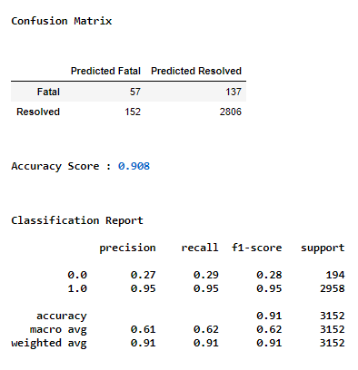

  

# Covid-19 and Public Health Units in Ontario

## Overview
This project is to showcase the strategical thinking and group efforts to predict and analyze the Covid-19 data. It is to recognize the trends of the highs and lows of Covid 19 cases at each of the 34 Public Health Unit in Ontario, Canada. 
 
## Research goal
***How do we determine the eligibility to excute a vaccine roll-out program?***

The goal of this analysis is to create a standard operating procedure (SOP) to determine a vaccine roll-out program.   The process stated here is to assist the Ministry of Health to identify, prioritize and execute vaccinations based on age group and or gender for future epidemics and pandemics.   
Data of current confirmed Covid-19 cases have been collected and used to create a machine learning model that can provide predictions and help understand the probability of higher cases within a specific attribute of demographics.   
The same data has been used for exploratory analysis to isolate results of each age group and gender for each Public Health Units.   
Below are the steps taken to provide results for this analysis.

 
**Data source:** 

[Ontario Data Catalogue](https://data.ontario.ca/dataset/confirmed-positive-cases-of-covid-19-in-ontario/resource/455fd63b-603d-4608-8216-7d8647f43350)

## Communication protocol
A group chat has been set up in Slack.  This will be the primary platform for ongoing correspondence by each team member while working on our individual roles for each segment.  Every Monday and Wednesday evenings will be an opportunity to meet via zoom and discussing the current week's agenda.  Every Sunday the team will connect via Google Meet as well to finalize the submission of the current week.  Additional meetings will be set up throughout the week when needed. 
Phone numbers have been exchanged and a group chat set up on WhatsApp for ad hoc communications as well.  
*Collaborators:* [Lida](https://github.com/lidajav), [Tarana](https://github.com/taranahassan), [Michelle](https://github.com/MichelleGoldfinger), [Blessing](https://github.com/Physsyb), [Faridah](https://github.com/faridah-m).

### Team Member roles:
***Tarana:***  Managining github and creating interactive dashboard. 
***Faridah:***  Creating presentation on google slides 
***Michelle:***  Creating an ERD and database. 
***Lida:*** Creating the machine learning model.  
***Blessing:***  Creating dashboard using a BI tool.

## Extract, Transform & Load

The original data downloaded had 527,180 records which is a much larger file to work with and push in github.  Therefore the dataset has been scaled down using a random sample method and creating a [sample_covid_dataset.csv](https://github.com/UofT-Government-Project/Covid19_PHU/blob/main/Datasource/sample_covid_dataset.csv), resulting in 13,524 records. 
This sampled dataset has been used for the database, machine learning model and the exploratory analysis.
 
Each team member has used the ETL process and saved work under their respective branches to show different perspectives if any.  

The general process that we will be following is as shown below:

### Extract:

For the extract process, the sample dataset was pulled and read using Pandas in Python in a Jupyter notebook file.  Allowing the team to use multiple libraries to transform the  data for required purposes.

### Transform:

The transformation process was required to clean data: 
  - drop any columns deemed unnecessary to the analysis  
  - drop any null values 
  - renaming column names for efficiency 
  - separating the case date column into week, month and year  
  - filter for specific requirements to be used for each part of project.  
The primary aim of the transformation process is to transform the data into a consistent structure.

### Load:

Finally, data will be loaded into a PostgreSQL database for easy distribution. SQL databases are often the targets of ETL processes, and because SQL is so ubiquitous, even databases that don't use SQL often have SQL-like interfaces.  The dataset will also be used for the project dashboard.
 

## Database 
After the cleaning and preprocessing of the dataset, the [cleaned_dataset](https://github.com/UofT-Government-Project/Covid19_PHU/blob/Week_2/Datasource/PHU_dataset_cleaned_michelle.csv) was split into four different tables.  Below is the ERD as a blueprint for the database, establishing the relationships created for each table.

### ERD:

### PostgreSQL Database:

The cleaned data was imported into a SQL database, Postgres using pgAdmin.  Using queries, a table named "phu" was created to host the entire dataset.  Further queries and fitering the main table, additional tables was created as well which then was saved as csv files; [PHU_locations.csv](https://github.com/UofT-Government-Project/Covid19_PHU/blob/michelle/Covid19_Datasources/PHU_locations.csv), [phu_age_group_final.csv](https://github.com/UofT-Government-Project/Covid19_PHU/blob/michelle/Covid19_Datasources/phu_age_group_final.csv) and [phu_gender_final.csv](https://github.com/UofT-Government-Project/Covid19_PHU/blob/michelle/Covid19_Datasources/phu_gender_final.csv).  *[schema1.sql](https://github.com/UofT-Government-Project/Covid19_PHU/blob/main/schema1.sql) file shows the queries.*

Using the newly saved csv files, four more tables were created and their corresponding data imported with queries.  *[schema2.sql](https://github.com/UofT-Government-Project/Covid19_PHU/blob/Week_2/schema2.sql) file shows the additional queries.*

 

##### Tables from schema2.sql:
1.  PHU_locations - details containing the name and ID associated for a specific PHU (Public Health Unit) along with the coordinates and physical address for all of 34 units.
2.  PHU - details include the age groups, gender, outcome for each case and the week, month and year for each case associated with each PHU ID.  An index ID was included to create a primary key to call on during queries.
3.  PHU_Gender_final - includes the gender and the count associated with each PHU ID.
4.  PHU_Age_Group_Final - contains the age group per case associated with each PHU ID.

### Joins:

Two more tables were created by joining tables using the inner join method:
  1.  phu_by_age_and_outcome  

  2.  phu_by_gender_and_outcome  

### Connection String:

To create a connection from the database into PostgreSql, the SQLAlchemy's create engine library was used to load the refined csv file.

### Database Storage:

A database instance was created on AWS' RDS (relational database) and four buckets, one for each table, were created using S3 - a public cloud storage on AWS.

## Machine Learning

For a machine learning model, particular steps need to be followed to ensure a successful model.  
  

### The Machine learning model: 

With the sample dataset, the machine learning model created is to predict a patient's probability of recovery from the Covid-19 virus based on the age group and gender.   
Ideally a dataset with patients' health history, ie; existing health conditions, would allow the model to predict to it's fullest extent.  After alot of research for the ideal dataset, it was difficult to find one that includes other factors of a patient's health, to provide continuous features which would provide a better prediction.  This information may not be available to the general public assuming it would be a privacy issue.   However based on the current dataset being the most relatable to the analysis and model, the current data is limited to age group and gender.  Therefore the RandomForest classifier (RFC) from ML sklearn library has been selected for the machine learning model.  This model type has a high accuracy score and is robust to outliers. There are also low correlations in features that requires multiple learning algorithms. 

### Cleaning and Preprocessing:

Similar to the ETL process, the dataset was required to be cleaned and preprocessed to avoid errors in the prediction.  The following steps were:
  - dropped unnecessary columns that have no impact on the predictation
  - renamed the column names
  - segregated case date to week, month and year
  - checked the categorial features
  - checked the unique value counts for PHU_ID to see if binning is required
  - plotted the density of value count of PHU_ID to determine what values to replace.

 
 
  - binned all PHU_IDs with less than 400 to keep the number of features at 10
  - converted the categorial features to continues by using OneHotEncoder from SKlearn library
  - merged the dataframes and dropped the categorial column

### Set the Target and features:

In order to focus the model's prediction to an outcome of "Recovered" or "Fatal, any rows with patients categorized as "Not Recovered" were taken out.  These records would mean the case is still active and therefore not valid for a prediction.  
For the model, "Fatal" cases has been set as the target variable *(y)* and the remainder features set as *(X)* minus the "Fatal" and "Recovered" cases.

### Training and testing set:  

Following the named target and features, the data was then split to training and testing sets by using the train_test_split function from the sklearn library.   
Furthermore both training and testing data sets were then scaled to normalize the data.

### RandomForest Classifier ML model:

After running the model, the accuracy score was 0.915.  The high accuracy is due to high recovery rate of covid.

### Confusion Matrix:

### Reasons for using RandomForest Classifier:

This model type has a high accuracy score and is robust to outliers. There are also low correlations in features that requires multiple learning algorithms. 

- It reduces overfitting in decision trees that improves high accuracy
- The model is robust to outliers.
- It works well with both categorial and continues values.  
- There are also low correlations in features that requires multiple learning algorithms.
- It automates missing values in the data.
 
### Limitations:

- Training large number of deep trees costs higher in terms of computing and memory usage
- More difficult to interpret comapares to individual decision trees 
- It has poorperformance on imbalanced data  

