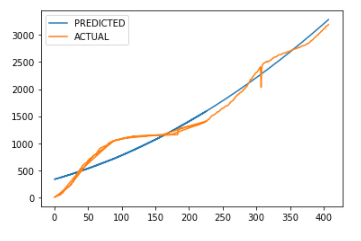

## Machine Learning- Exploratory Model for for a database with accumulative quantities (Optional)

This is about exploring a machine learning model to predit exponential quatntities in column of a dataset and measure the accuracy of the model. We chose Linear Regression and scaled the accumulative data by using square root of the accumulated data.

### Linear Regression using normalization on accumulative quantities 

- from sklearn.linear_model import LinearRegression

### About Dataset

- This dataset has 5 features : Date, Public Unit Number(PHU_NUM), Active Covid cases, Resolved covid cases and Deaths.
- The Activa cases, reolved and deaths were accumulating data.  

### Cleaning 

- The date was converted to ordinal day by using toordinal function.  
- We also removed Active cases and Resolved cases from the dataset as they would highly affect the result and would cause overfitting. 
- Every Public unit number( or region) had a different curve and for that reason the dataset should have been ran for each region seperately.For that reason we used the model on Toronto that had the highest cases in our dataset.  

### The Goal

- To predict deaths in the future if no external factor impacts the data. This is a useful analysis to view how the cases will climb if the lockdown or vaccine or any other health measure is not imposed.  

### Scaling Data

- To normalize accumulating (exponential) data we calcuated square root of the data set and reversed it back by squaring the numbers.
- The other option to normalize the exponential data was using logarithm and reverse it by power operator. 

### Set the Target and features

- Set 'Deaths' as our target(y)
- The ordinal date was the feaure (X)

### Training and testing set:  
- Split our data into training and testing by train_test_split function from sklearn library

### How good did the model fit?
- The R_squared score was strong at 0.96

### Prediction versus Target graph 
 
 

  

